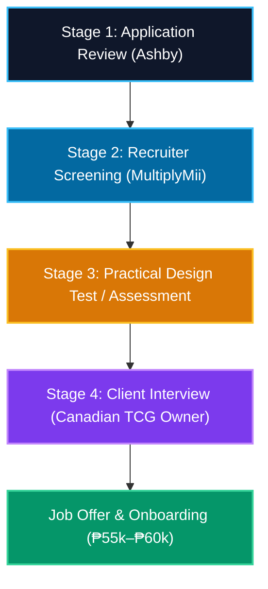
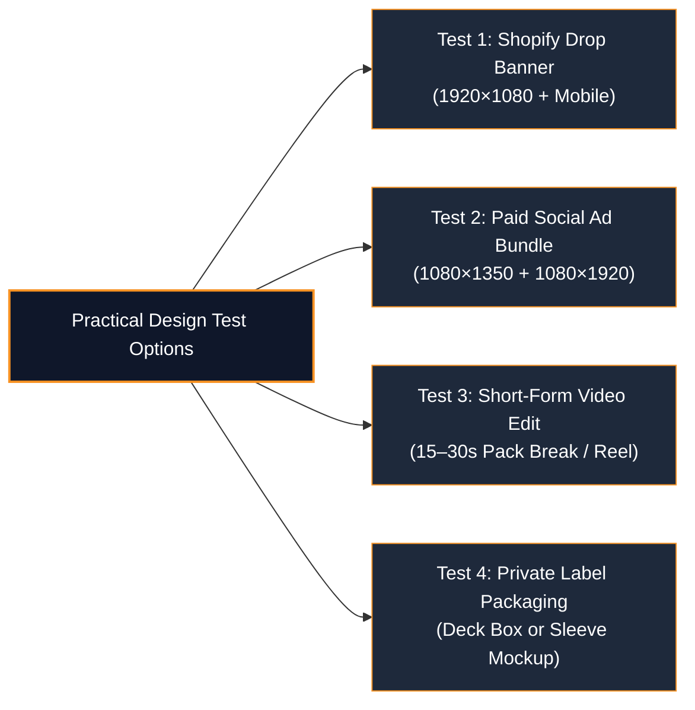

# 🃏 Master Interview & Practical Test Playbook
## Role: E-commerce Graphic Designer @ MultiplyMii (Canada TCG Retailer)

- **Position Type:** Full-Time (with Canadian Eastern Time morning overlap)
- **Schedule:** Monday–Friday, **5:00 AM – 2:00 PM PHT** (strong overlap with Canadian team)
- **Target Compensation:** **₱55,000 – ₱60,000 PHP per month** (sweet spot for mid-level e-commerce designer)
- **Core Franchises:** Pokémon TCG, Magic: The Gathering (MTG), One Piece Card Game, League of Legends / Lorcana, sports cards, model kits (Gunpla), hobby supplies (VaultX / Ultimate Guard / Dragon Shield style).
- **Your Live Portfolio Showcase:** [`index.html#work`](file:///d:/Jezreel%20Dave%20-%20Personal%20Branding/my-personal-website/index.html#work) (Filter: **TCG & Pop Culture**)

---

## 🗺️ The 3-Stage Selection Process Breakdown

---

## 🎙️ STAGE 1: RECRUITER SCREENING INTERVIEW (MULTIPLYMII)

**Interviewer:** MultiplyMii Talent Acquisition Partner  
**Duration:** 20–30 minutes via Google Meet or Zoom  
**Recruiter's Primary Agenda:**
1. Verify spoken English clarity, professionalism, and communication confidence.
2. Confirm 100% agreement with the **5:00 AM PHT start time**.
3. Verify salary alignment (**₱55,000 – ₱60,000 PHP**).
4. Verify home office equipment (PC workstation, fiber internet, backup power).
5. Gauge authentic interest and understanding of the trading card game and pop culture space.

---

### Key Recruiter Questions & Word-for-Word Scripts

#### Q1: "Tell me about yourself and your background as a Graphic Designer."
> **Your Script:**  
> *"I'm a visual designer and video editor with over 4 years of hands-on experience creating high-converting e-commerce storefront assets, brand merchandise, and digital marketing content for international brands across North America, Europe, and Asia.*  
>  
> *Most recently, I've managed digital storefront design, collection banners, and short-form video content that drove a 30% increase in digital order volume and elevated social engagement. I also have deep experience creating Amazon listing assets, packaging composites, and lifestyle product renders for Canadian e-commerce retailers like TrendNSave.*  
>  
> *What makes me especially excited about this specific opportunity with MultiplyMii is that it combines my core professional strengths—Shopify storefront design, conversion-focused paid social ads, and video editing—with my genuine personal passion for trading card games and pop culture franchises like Pokémon, One Piece, and Magic: The Gathering."*

---

#### Q2: "The client emphasized industry familiarity with Pokémon, MTG, One Piece, etc. How familiar are you with trading card games and the collectibles community?"
> **Your Script:**  
> *"I am genuinely passionate about and familiar with the TCG ecosystem. I understand the collector mindset and the rhythm of set releases.*  
>  
> *For example, with **Pokémon**, I know how critical chase card hype is—whether it's an alternate art Charizard ex, an illustration rare, or set releases like Prismatic Evolutions and Obsidian Flames. With **One Piece TCG**, the community responds to dynamic manga alternate art, leader card framing, and tournament staples. For **Magic: The Gathering**, it's about the distinct mana color identities, foil-etched finishes, and collector booster aesthetics.*  
>  
> *Because I understand card rarities, grading psychology (like PSA 10 gem mints), and collector terminology, the client won't have to spend time explaining what makes a card special or how card art should be framed. I can take a release calendar and immediately design assets that speak the community's native visual language."*

---

#### Q3: "This role requires starting around 5:00 AM to 6:00 AM Philippine Time to overlap with Canadian Eastern Time. How do you feel about this schedule?"
> **Your Script:**  
> *"I am 100% prepared and eager to work the 5:00 AM PHT start time. In fact, throughout my freelance and remote career, I have regularly aligned my working hours with North American clients in Eastern and Central time zones.*  
>  
> *I have a dedicated, distraction-free home office setup equipped with a high-performance Windows 11 creator workstation, 300 Mbps fiber internet, a 4G LTE hotspot failover, and dual UPS battery backups. You can count on me being logged in, energized, and ready to collaborate every morning at 5:00 AM without fail."*

---

#### Q4: "What are your salary expectations for this role?"
> **Your Script:**  
> *"Based on my 4+ years of specialized e-commerce design experience, my proficiency across the Adobe Creative Suite, CapCut, and Shopify, and the full-time Canadian schedule overlap, my target salary is **₱55,000 to ₱60,000 PHP per month**.  
>  
> I am confident that my ability to step in on Day 1, take ownership of storefront visuals, and produce community-aligned TCG assets without creative friction will provide immediate return on investment for the client."*

---

## 🧪 STAGE 2: PRACTICAL DESIGN TEST / ASSESSMENT

The job posting explicitly states that the interview process typically includes a **Practical Test**. In the TCG and hobby retail space, design assessments usually fall into one of four formats:

### The Winning Practical Test Blueprint (Scoring 10/10)

Whenever you receive the design test prompt, follow these golden rules:

#### 1. Always Deliver Both Desktop & Mobile Versions
E-commerce hobby sites receive **65%+ of their traffic on mobile devices** (collectors checking drops on Instagram or Reddit links).
- **Desktop:** 1920×1080 px or 2560×1200 px (ultra-wide banner). Keep text and hero elements in the central 1400px safe zone.
- **Mobile Crop:** 1080×1080 px or 1080×1350 px. Enlarge the product booster box and headline so it is 100% legible on a smartphone screen without squinting.

#### 2. Incorporate Canadian E-Commerce Signals
- Mention Canadian currency (**$ CAD**) or Canadian shipping incentives (**"FREE TRACKED SHIPPING ACROSS CANADA ON ORDERS OVER $150 CAD"**).
- Add authentic retailer badges: **"100% FACTORY SEALED"**, **"OFFICIAL CANADIAN DISTRIBUTOR"**, **"AUTHENTICITY GUARANTEED"**.

#### 3. Master Rarity & Collector Aesthetics
- Do not use generic flat images. Add subtle **holographic iridescent foil sheens**, starbursts, and radial lighting around chase cards.
- If featuring a single card, place it in an acrylic grading slab (PSA/BGS style) or a magnetic one-touch case to signify high collector value.

#### 4. Package Your Submission Like a Senior Art Director
When submitting your test back to MultiplyMii, **do not just send a flat PNG**:
- Create a clean Google Drive folder with:
  1. `01_Final_Exports/` (High-res WebP, PNG, JPG).
  2. `02_Editable_Source_Files/` (Organized, labeled layers in `.PSD` or `.AI`).
  3. `03_Design_Rationale_Deck.pdf` (A 1-to-2 page PDF explaining your typography choices, visual hierarchy, mobile safe-zone strategy, and CTR conversion drivers).
*Submitting a design rationale document instantly sets you apart from 99% of other applicants.*

---

## 🤝 STAGE 3: CLIENT INTERVIEW (CANADIAN TCG RETAILER)

**Interviewer:** Canadian Store Founder / Marketing Director / Creative Lead  
**Mindset of the Client:**  
Canadian hobby shop owners operate in a fiercely competitive, hype-driven retail environment. Releases happen every 2–4 weeks across Pokémon, MTG, One Piece, Yu-Gi-Oh, sports cards, and model kits. They want a designer who:
- Can work autonomously without needing basic TCG concepts explained.
- Can create structured templates so recurring drops don't take 3 days to design.
- Can balance "geek culture authenticity" with "clean commercial e-commerce conversion".

---

### High-Impact Client Q&A

#### Q1: "How do you approach designing for a brand new expansion release when official assets might be limited?"
> **Your Script:**  
> *"When a new expansion is announced, official high-res assets can sometimes be sparse initially. My workflow is:*  
> *1. **Official Teasers & Pack Art:** I source the official packaging reveals from distributor portals or Japanese/English official announcements, vectorizing logos and upscaling packaging textures cleanly.*  
> *2. **Thematic Visual Language:** I build atmospheric environmental backgrounds that match the set's identity—for instance, dark cosmic fire for Pokémon Obsidian Flames, oceanic action motifs for One Piece, or gothic fantasy for MTG Duskmourn.*  
> *3. **Pre-Order Structure:** Because pre-orders need clear information, I establish a rigid information hierarchy: Set Name & Franchise Logo at top, 3D booster box mockups with dynamic card reveals in center, and clear delivery dates + pre-order CTA at the bottom.*  
> *This ensures the storefront looks world-class even before physical inventory arrives in warehouse."*

---

#### Q2: "How do you keep design assets organized and efficient when managing hundreds of products across Shopify?"
> **Your Script:**  
> *"I rely heavily on modular template systems. In Photoshop and Illustrator, I maintain master Smart Object templates with consistent canvas dimensions, bleed guides, and color profile settings (sRGB for web).*  
>  
> *For Shopify, I create category design systems where the framing, badge locations, and button styles remain uniform while allowing the featured card or franchise asset to swap out seamlessly. This means when a new set drops or a flash sale happens, I can roll out a homepage banner, three collection headers, and matching social ad sizes in hours rather than days."*

---

#### Q3: "Can you edit short-form videos? How would you make our social media videos stand out?"
> **Your Script:**  
> *"Yes, I actively edit short-form content using CapCut and Adobe Premiere Pro. For trading cards and collectibles, video success hinges on the first 3 seconds:  
> • **The Hook:** Start directly on the pack tear, a mystery card silhouette, or a dynamic question overlay ('Did we pull the $500 Alt Art?').  
> • **Pacing & Micro-Cuts:** Common cards are shown rapidly (sub-1 second flash), building anticipation before hitting the rare card with a subtle slow-motion punch-in.  
> • **Sonic Design:** Adding crisp tactile Foley sound effects on card sliding and a deep bass drop when the holographic foil hits the light.  
> • **Kinetic Captions:** Word-by-word bold animated captions with brand-colored highlight keywords so viewers watching on mute still engage."*

---

#### Q4: "Walk me through one of the TCG projects in your portfolio."
> **Your Script (Highlighting the Apex Guard Titan Vault Deck Box):**  
> *"I'd love to walk you through the **Apex Guard 'Titan Vault'** private label packaging project in my portfolio.*  
>  
> *The objective was to create a luxury private-label deck box that felt as premium as established brands like Ultimate Guard or VaultX, but with distinctive Canadian pride.*  
>  
> *I designed the physical packaging dieline with embossed metallic gold foil stamping against a matte black leatherette finish, featuring a bold heraldic lion crest. On the outer retail box, I strategically placed the collector specifications—'100+ Double Sleeved Cards' and 'Archival Safe & Acid Free'—paired with a subtle Canadian maple leaf emblem.*  
>  
> *This balance of premium aesthetics and clear functional specs builds immediate trust with competitive players who need to know their high-value cards are protected."*

---

## ❓ Killer Reverse-Interview Questions to Ask the Client

At the end of the interview when they ask *"Do you have any questions for us?"*, ask these to prove you think like an e-commerce partner:

1. *"How often do you refresh your Shopify homepage and collection banners—is it strictly tied to official set release dates, or do you also run weekly promotional events and live box breaks?"*
2. *"Are you currently looking to expand your private label product line—such as custom playmats, card binders, or deck boxes—and what does your supplier workflow look like for packaging files?"*
3. *"What does your streaming schedule look like right now, and are there specific live commerce platforms (like Twitch, YouTube, or Whatnot) where you want to upgrade your broadcast overlay branding?"*
4. *"What are the biggest visual bottlenecks your team has faced over the past 6 months when preparing for major TCG launch days?"*

---

## 📋 Quick Action Checklist

- [x] **Ashby Application Submitted** with tailored cover letter and portfolio link.
- [x] **Portfolio Synced** with 4 dedicated TCG deliverables at [`index.html#work`](file:///d:/Jezreel%20Dave%20-%20Personal%20Branding/my-personal-website/index.html#work).
- [x] **Word & PDF Resumes Ready:** [`Jezreel_Dave_Leybag_Ecommerce_Graphic_Designer.pdf`](file:///d:/Jezreel%20Dave%20-%20Personal%20Branding/my-personal-website/applications/multiplymii-ecommerce-graphic-designer/Jezreel_Dave_Leybag_Ecommerce_Graphic_Designer.pdf).
- [x] **Interview Scripts Reviewed:** Memorized talking points for 5:00 AM PHT schedule, ₱55k–₱60k salary, and TCG franchise fluency.
- [x] **Practical Test Arsenal Ready:** Prepared to produce mobile + desktop banners, layered PSDs, and design rationale decks on demand.
